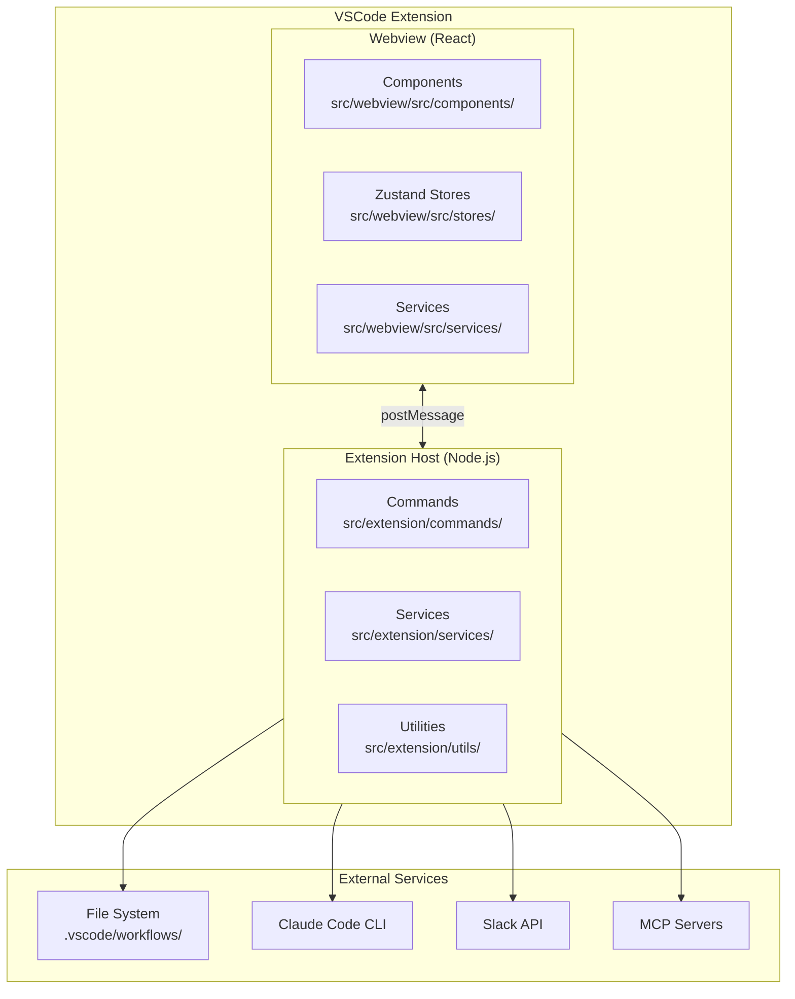
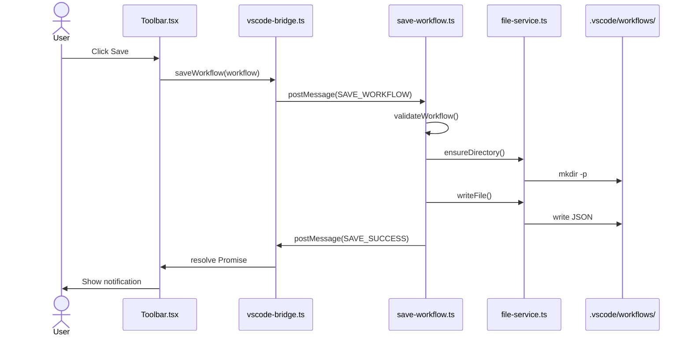
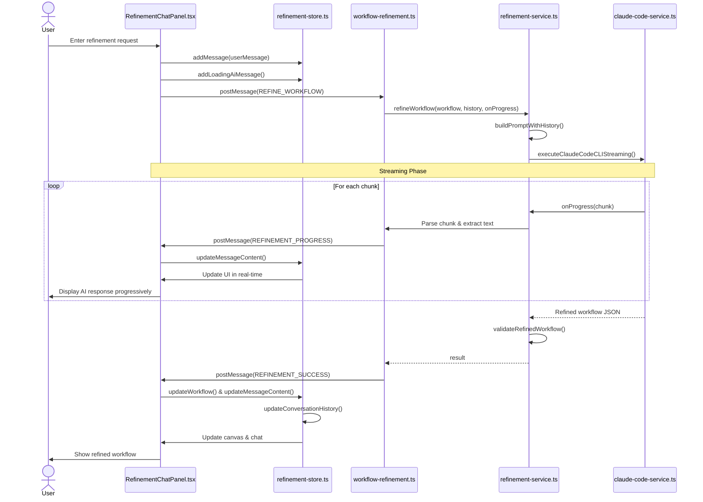
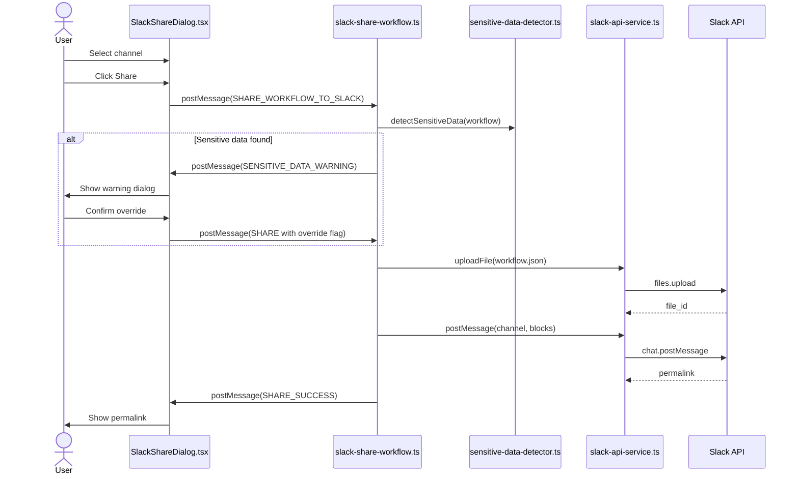
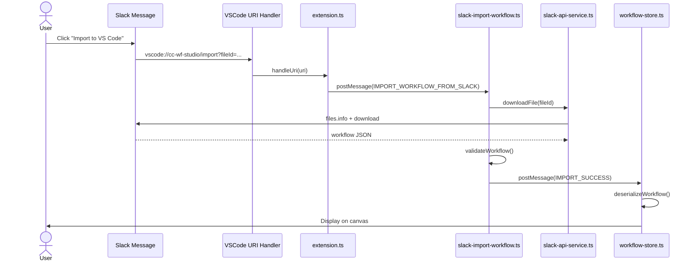
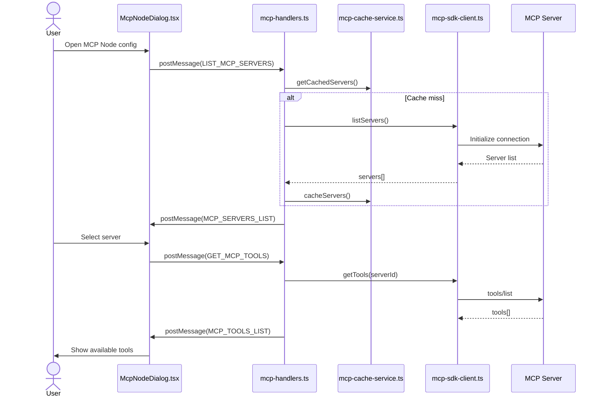

# cc-wf-studio Development Guidelines / 开发指南

Auto-generated from all feature plans. Last updated: 2025-11-01 / 根据所有功能计划自动生成。最后更新：2025-11-01

## Active Technologies / 核心技术栈
- ローカルファイルシステム / 本地文件系统 (`.vscode/workflows/*.json`, `.claude/skills/*.md`, `.claude/commands/*.md`) (001-cc-wf-studio)
- TypeScript 5.3 (VSCode Extension Host), React 18.2 (Webview UI). Compatible with VS Code, Cursor, Windsurf, Trae, Qoder. / TypeScript 5.3 (VSCode 扩展宿主), React 18.2 (Webview UI)。兼容 VS Code, Cursor, Windsurf, Trae, Qoder。 (001-node-types-extension)
- ローカルファイルシステム / 本地文件系统 (`.vscode/workflows/*.json`) (001-node-types-extension)
- TypeScript 5.3 (Extension Host & Webview shared types), React 18.2 (Webview UI) (001-ai-workflow-generation)
- File system (workflow schema JSON in resources/, generated workflows in canvas state) / 文件系统（resources/ 中的工作流架构 JSON，画布状态中的生成工作流） (001-ai-workflow-generation)
- TypeScript 5.3.0 (001-skill-node)
- File system (SKILL.md files in `~/.claude/skills/` and `.claude/skills/`), workflow JSON files in `.vscode/workflows/` / 文件系统（`~/.claude/skills/` 和 `.claude/skills/` 中的 SKILL.md 文件），`.vscode/workflows/` 中的工作流 JSON 文件 (001-skill-node)
- TypeScript 5.3 (Extension Host), React 18.2 (Webview UI) (001-ai-skill-generation)
- File system (existing SKILL.md files in `~/.claude/skills/` and `.claude/skills/`, workflow-schema.json in resources/) / 文件系统（`~/.claude/skills/` 和 `.claude/skills/` 中现有的 SKILL.md 文件，resources/ 中的 workflow-schema.json） (001-ai-skill-generation)
- Workflow JSON files in `.vscode/workflows/` directory (conversation history embedded in workflow metadata) / `.vscode/workflows/` 目录中的工作流 JSON 文件（对话历史嵌入在工作流元数据中） (001-ai-workflow-refinement)
- TypeScript 5.3.0 (VSCode Extension Host), TypeScript/React 18.2 (Webview UI) + VSCode Extension API 1.80.0+, React 18.2, React Flow (visual canvas), Zustand (state management), child_process (Claude Code CLI execution) (001-mcp-node)
- Workflow JSON files in `.vscode/workflows/` directory, Claude Code MCP configuration (user/project/enterprise scopes) / `.vscode/workflows/` 目录中的工作流 JSON 文件，Claude Code MCP 配置（用户/项目/企业范围） (001-mcp-node)
- TypeScript 5.3.0 (VSCode Extension Host), TypeScript/React 18.2 (Webview UI) + VSCode Extension API 1.80.0+, React 18.2, React Flow (visual canvas), Zustand (state management), existing MCP SDK client services (001-mcp-natural-language-mode)
- Workflow JSON files in `.vscode/workflows/` directory (extends existing McpNodeData structure) / `.vscode/workflows/` 目录中的工作流 JSON 文件（扩展了现有的 McpNodeData 结构） (001-mcp-natural-language-mode)
- TypeScript 5.3 (VSCode Extension Host), React 18.2 (Webview UI), @slack/web-api 7.x, Node.js http (OAuth callback server), VSCode Secret Storage (001-slack-workflow-sharing)
- Workflow JSON files in `.vscode/workflows/` directory, Slack message attachments (workflow storage), VSCode Secret Storage (OAuth tokens) / `.vscode/workflows/` 目录中的工作流 JSON 文件，Slack 消息附件（工作流存储），VSCode Secret Storage (OAuth 令牌) (001-slack-workflow-sharing)

- TypeScript 5.x (VSCode Extension Host), React 18.x (Webview UI) (001-cc-wf-studio)

## Project Structure / 项目结构

```text
src/
tests/
```

## Development Workflow & Commands / 开发工作流与命令

### Commit Message Guidelines / 提交信息规范

**IMPORTANT: Keep commit messages simple for squash merge workflow. / 重要：保持提交信息简单，以适配 squash merge 工作流。**

#### Format / 格式
```
<type>: <subject>

<optional body with bullet points>
```

#### Example / 示例
```
fix: add missing MCP node definition to workflow schema

- Added 'mcp' to supportedNodeTypes
- Added complete MCP node type definition with field constraints
- Fixes MCP_INVALID_PARAMETERS and MCP_INVALID_MODE validation errors
```

#### Rules / 规则
- **Subject**: 50 characters max, imperative mood, no period / **主题**：最多 50 个字符，使用祈使句，末尾不加句号
- **Body**: 3-5 bullet points max, "what" changed only / **正文**：最多 3-5 个要点，仅描述“变更内容”
- **Details**: Put "why" and "how" in PR description, NOT commit message / **详情**：将“原因”和“方式”放在 PR 描述中，而非提交信息中

#### Types / 类型
- `feat:` - New feature (minor version bump) / 新功能（次版本号更新）
- `fix:` - Bug fix (patch version bump) / 缺陷修复（修订号更新）
- `improvement:` - Minor enhancement to existing feature (patch version bump) / 对现有功能的微小增强（修订号更新）
- `docs:` - Documentation only / 仅文档
- `refactor:` - Code refactoring / 代码重构
- `chore:` - Build/tooling changes / 构建/工具链变更

#### What to Avoid / 应避免的内容
❌ Long explanations (Problem/Solution/Impact sections) / 详细解释（问题/解决方案/影响部分）
❌ Multiple paragraphs / 多个段落
❌ Code blocks / 代码块
❌ Test results with checkboxes / 带有复选框的测试结果

✅ Simple 3-5 line summary of changes / 简单的 3-5 行变更摘要

### Code Quality Checks (Required Before Commit/PR) / 代码质量检查（提交/PR 前必做）

**Always run these commands in the following order after code modifications: / 代码修改后，请务必按以下顺序运行这些命令：**

```bash
npm run format  # Auto-format code with Biome / 使用 Biome 自动格式化代码
npm run lint    # Check for linting issues / 检查代码规范问题
npm run check   # Run all Biome checks (lint + format verification) / 运行所有 Biome 检查（规范 + 格式验证）
npm run build   # Build extension and webview (verify compilation) / 构建插件和 Webview（验证编译）
```

### Command Execution Timing / 命令执行时机

#### During Development / 开发期间
1. **After code modification / 代码修改后**:
   ```bash
   npm run format && npm run lint && npm run check
   ```
   - Fixes formatting issues automatically / 自动修复格式问题
   - Identifies linting problems / 识别规范问题
   - Verifies code quality standards / 验证代码质量标准

2. **Before manual E2E testing / 手动 E2E 测试前**:
   ```bash
   npm run build
   ```
   - Compiles TypeScript and builds extension / 编译 TypeScript 并构建插件
   - Required for testing changes in VSCode / 在 VSCode 中测试变更所必需

3. **Before git commit / Git 提交前**:
   ```bash
   npm run format && npm run lint && npm run check
   ```
   - Ensures all code quality standards are met / 确保符合所有代码质量标准
   - Prevents committing code with linting/formatting issues / 防止提交带有规范/格式问题的代码

#### Testing / 测试
- **Unit/Integration tests / 单元/集成测试**: Not required (manual E2E testing only) / 不需要（仅进行手动 E2E 测试）
- **Manual E2E testing / 手动 E2E 测试**: Required for all feature changes and bug fixes / 所有功能变更和缺陷修复均需进行
  - Run `npm run build` first / 先运行 `npm run build`
  - Test in VSCode Extension Development Host / 在 VSCode 插件开发宿主环境中进行测试

## Version Update Procedure / 版本更新流程

**IMPORTANT: Version updates and releases are fully automated via Semantic Release and GitHub Actions. / 重要：版本更新和发布通过 Semantic Release 和 GitHub Actions 完全自动化。**

### Automated Release Process / 自动化发布流程

This project uses **Semantic Release** with **GitHub Actions** for fully automated versioning, changelog generation, and publishing. / 本项目使用 **Semantic Release** 配合 **GitHub Actions** 实现完全自动化的版本控制、变更日志生成和发布。

#### Release Workflow (`.github/workflows/release.yml`) / 发布工作流

**Trigger / 触发器**: Push to `production` branch / 推送到 `production` 分支

**Automated Steps / 自动化步骤**:
1. **Semantic Release** analyzes commit messages and determines version bump / **Semantic Release** 分析提交信息并确定版本升级类型
2. **Version Update / 版本更新**: Updates `package.json`, `src/webview/package.json`, `src/webview/package-lock.json` / 更新相关配置文件
3. **Changelog Generation / 变更日志生成**: Automatically updates `CHANGELOG.md` / 自动更新 `CHANGELOG.md`
4. **Git Commit / Git 提交**: Creates release commit with message `chore(release): ${version} [skip ci]` / 创建发布提交
5. **GitHub Release / GitHub 发布**: Creates GitHub release with release notes / 创建带有发布说明的 GitHub Release
6. **VSIX Build / VSIX 构建**: Builds and packages the extension / 构建并打包插件
7. **VSIX Upload / VSIX 上传**: Uploads `.vsix` file to GitHub release / 将 `.vsix` 文件上传到 GitHub Release
8. **Version Sync / 版本同步**: Merges version changes from `production` to `main` branch / 将版本变更从 `production` 分支合并到 `main` 分支

#### Commit Message Convention (Conventional Commits) / 提交信息规范（常规提交）

The version bump is determined by commit message prefixes: / 版本升级由提交信息前缀决定：

- `feat:` → **Minor** version bump (e.g., 2.0.0 → 2.1.0) / **次版本号**升级
- `fix:` → **Patch** version bump (e.g., 2.1.0 → 2.1.1) / **修订号**升级
- `improvement:` → **Patch** version bump (minor enhancements to existing features) / **修订号**升级（对现有功能的微小增强）
- `perf:` → **Patch** version bump / **修订号**升级
- `revert:` → **Patch** version bump / **修订号**升级
- **BREAKING CHANGE** in commit body → **Major** version bump (e.g., 2.1.0 → 3.0.0) / 正文中的 **破坏性变更** → **主版本号**升级
- `docs:`, `style:`, `chore:`, `refactor:`, `test:`, `build:`, `ci:` → No release / 不发布新版本

**Example commit messages / 提交信息示例**:
```bash
feat: add MCP node integration
fix: resolve parameter validation issue
feat!: redesign workflow export format (BREAKING CHANGE)
```

#### Changelog Sections (`.releaserc.json`) / 变更日志章节

Generated changelog groups commits by type: / 生成的变更日志按类型对提交进行分组：

- **Features / 新功能** (`feat:`)
- **Bug Fixes / 缺陷修复** (`fix:`)
- **Improvements / 改进** (`improvement:`)
- **Performance Improvements / 性能优化** (`perf:`)
- **Reverts / 回滚** (`revert:`)
- **Code Refactoring / 代码重构** (`refactor:`) - visible / 可见
- **Documentation / 文档** (`docs:`) - visible / 可见
- **Styles / 样式** (`style:`) - hidden / 隐藏
- **Tests / 测试** (`test:`) - hidden / 隐藏
- **Build System / 构建系统** (`build:`) - hidden / 隐藏
- **Continuous Integration / 持续集成** (`ci:`) - hidden / 隐藏
- **Miscellaneous Chores / 其他杂务** (`chore:`) - hidden / 隐藏

#### Automated File Updates / 自动化文件更新

Semantic Release automatically updates: / Semantic Release 会自动更新：
- `package.json` (root)
- `src/webview/package.json`
- `src/webview/package-lock.json`
- `CHANGELOG.md`

These files are committed with `[skip ci]` to prevent infinite loops. / 这些文件在提交时会带有 `[skip ci]` 以防止无限循环。

#### Manual Version Updates (NOT RECOMMENDED) / 手动版本更新（不推荐）

**DO NOT manually update version numbers unless absolutely necessary. / 除非绝对必要，否则请勿手动更新版本号。**

If manual update is required: / 如果需要手动更新：
1. Update `package.json` (root directory) - `"version"` field / 更新根目录的 `package.json` 中的 `"version"` 字段
2. Update `src/webview/package.json` - `"version"` field / 更新 `src/webview/package.json` 中的 `"version"` 字段
3. Run `cd src/webview && npm install` to update `package-lock.json` / 运行命令更新 `package-lock.json`
4. Commit all three files together / 同时提交这三个文件

Manual version updates will be overwritten by the next automated release. / 手动版本更新将被下一次自动化发布覆盖。

## Code Style / 代码风格

TypeScript 5.x (VSCode Extension Host), React 18.x (Webview UI): Follow standard conventions / 遵循标准规范

## Recent Changes / 最近变更
- 001-mcp-natural-language-mode: Added TypeScript 5.3.0 (VSCode Extension Host), TypeScript/React 18.2 (Webview UI) + VSCode Extension API 1.80.0+, React 18.2, React Flow (visual canvas), Zustand (state management), existing MCP SDK client services
- 001-mcp-node: Added TypeScript 5.3.0 (VSCode Extension Host), TypeScript/React 18.2 (Webview UI) + VSCode Extension API 1.80.0+, React 18.2, React Flow (visual canvas), Zustand (state management), child_process (Claude Code CLI execution)


<!-- MANUAL ADDITIONS START -->

## Architecture Sequence Diagrams / 架构序列图

このセクションでは、cc-wf-studioの主要なデータフローをMermaid形式のシーケンス図で説明します。 / 本章节通过 Mermaid 格式的序列图说明 cc-wf-studio 的主要数据流。

### アーキテクチャ概要 / 架构概览



### ワークフロー保存フロー / 工作流保存流



### AI ワークフロー改善フロー (Refinement) / AI 工作流优化流 (Refinement)



### Slack ワークフロー共有フロー / Slack 工作流共享流



### Slack ワークフローインポートフロー (Deep Link) / Slack 工作流导入流 (Deep Link)



### MCP サーバー/ツール取得フロー / MCP 服务/工具获取流



---

## AI-Assisted Skill Node Generation (Feature 001-ai-skill-generation) / AI 辅助技能节点生成

### Key Files and Components / 关键文件与组件

#### Extension Host Services / 插件宿主服务
- **src/extension/services/skill-relevance-matcher.ts**
  - Calculates relevance scores between user descriptions and Skills using keyword matching / 使用关键词匹配计算用户描述与技能之间的相关性分数
  - `tokenize()`: Removes stopwords, filters by min length (3 chars) / 分词：移除停用词，按最小长度（3 字符）过滤
  - `calculateSkillRelevance()`: Formula: `score = |intersection| / sqrt(|userTokens| * |skillTokens|)` / 计算技能相关性公式
  - `filterSkillsByRelevance()`: Filters by threshold (0.6), limits to 20, prefers project scope / 按阈值（0.6）过滤，限制为 20 个，优先选择项目范围
  - No new library dependencies (per user constraint) / 无新库依赖（根据用户约束）

- **src/extension/commands/ai-generation.ts** (Enhanced) / （增强版）
  - Scans personal + project Skills in parallel (`Promise.all`) / 并行扫描个人和项目技能
  - Filters Skills by relevance to user description / 根据用户描述的相关性过滤技能
  - Constructs AI prompt with "Available Skills" section (JSON format) / 构建包含“可用技能”部分的 AI 提示词（JSON 格式）
  - Resolves `skillPath` post-generation for AI-generated Skill nodes / 为 AI 生成的技能节点解析生成后的 `skillPath`
  - Marks missing Skills as `validationStatus: 'missing'` / 将缺失的技能标记为 `validationStatus: 'missing'`

- **src/extension/utils/validate-workflow.ts** (Extended) / （扩展版）
  - `validateSkillNode()`: Validates required fields, name format, length constraints / 验证必填字段、名称格式、长度限制
  - Error codes: SKILL_MISSING_FIELD, SKILL_INVALID_NAME, SKILL_NAME_TOO_LONG, etc. / 错误代码
  - Integrated into `validateAIGeneratedWorkflow()` flow / 集成到 `validateAIGeneratedWorkflow()` 流程中

#### Resources / 资源
- **resources/workflow-schema.json** (Updated) / （更新版）
  - Added Skill node type documentation (~1.5KB addition) / 添加了技能节点类型文档
  - Instructions for AI: "Use when user description matches Skill's purpose" / 给 AI 的指令：“当用户描述匹配技能用途时使用”
  - Field descriptions: name, description, scope, skillPath (auto-resolved), validationStatus / 字段说明
  - File size: 16.5KB (within tolerance) / 文件大小（在容差范围内）

### Message Flow / 消息流
```
Webview (AiGenerationDialog)
  → postMessage(GENERATE_WORKFLOW)
  → Extension (ai-generation.ts)
  → scanAllSkills() + loadWorkflowSchema() (parallel)
  → filterSkillsByRelevance(userDescription, availableSkills)
  → constructPrompt(description, schema, filteredSkills)
  → ClaudeCodeService.executeClaudeCodeCLI()
  → Parse & resolveSkillPaths(workflow, availableSkills)
  → Validate (including Skill nodes)
  → postMessage(GENERATION_SUCCESS | GENERATION_FAILED)
  → Webview (workflow-store.addGeneratedWorkflow())
```

### Key Constraints / 关键约束
- Max 20 Skills in AI prompt (prevent timeout) / AI 提示词中最多 20 个技能（防止超时）
- Relevance threshold: 0.3 (30%) - tested 0.5 but 0.3 provides better recall without sacrificing quality / 相关性阈值：0.3 (30%) - 测试过 0.5 但 0.3 在不牺牲质量的情况下提供更好的召回率
- Keyword matching: O(n+m) complexity / 关键词匹配：O(n+m) 复杂度
- Duplicate handling: Project scope preferred over personal / 重复处理：优先选择项目范围而非个人
- Generation timeout: 90 seconds / 生成超时：90 秒

### Error Handling / 错误处理
- Skill not found → `validationStatus: 'missing'` / 未找到技能
- Skill file malformed → `validationStatus: 'invalid'` / 技能文件格式错误
- All errors logged to "Claude Code Workflow Studio" Output Channel / 所有错误均记录到 "Claude Code Workflow Studio" 输出通道

### Design Decisions & Lessons Learned / 设计决策与经验教训

**Phase 5 (User Skill Selection) - Rejected / 第 5 阶段（用户技能选择）- 已拒绝**

During development, we attempted to implement a UI feature allowing users to manually select which Skills to include/exclude in AI generation. This was intended to prevent timeouts when users have many Skills installed. / 在开发过程中，我们尝试实现一个 UI 功能，允许用户手动选择在 AI 生成中包含/排除哪些技能。这是为了防止用户安装了过多技能时出现超时。

**Why it was rejected: / 为什么被拒绝：**
- **AI generation control has inherent limitations**: The AI prompt is a "suggestion" not a "command" / **AI 生成控制具有固有局限性**：AI 提示词是“建议”而非“命令”
- **Unpredictable behavior**: Even when Skills are excluded from the prompt, the AI may still generate Skill nodes based on its own interpretation of the user's description / **行为不可预测**：即使从提示词中排除了某些技能，AI 仍可能根据其对用户描述的理解生成技能节点
- **Poor UX**: Users selecting "don't use this Skill" would experience confusion when the AI uses it anyway / **体验差**：如果用户选择了“不要使用此技能”，但 AI 仍然使用了它，用户会感到困惑
- **Uncontrollable AI behavior**: The final decision of which nodes to generate belongs to the AI, not the prompt engineering / **不可控的 AI 行为**：最终决定生成哪些节点的是 AI，而非提示词工程

**Key lesson: / 关键教训：**
> Do not implement user-facing features that promise control over AI behavior that cannot be guaranteed. AI generation is inherently probabilistic, and features requiring deterministic outcomes should be avoided. / 不要实现承诺控制无法保证的 AI 行为的面向用户功能。AI 生成本质上是概率性的，应避免要求确定性结果的功能。

**Alternative approaches for timeout prevention: / 防止超时的替代方法：**
- Dynamic timeout adjustment based on Skill count / 根据技能数量动态调整超时时间
- Adaptive relevance threshold tuning (e.g., 0.3 → 0.5 for high Skill counts) / 自适应相关性阈值调整
- Maintain strict MAX_SKILLS_IN_PROMPT limit (currently 20) / 保持严格的提示词最大技能数限制（当前为 20）

---

## AI-Assisted Workflow Generation (Feature 001-ai-workflow-generation) / AI 辅助工作流生成

### Key Files and Components / 关键文件与组件

#### Extension Host Services / 插件宿主服务
- **src/extension/services/claude-code-service.ts**
  - Executes Claude Code CLI via child_process.spawn() / 通过 child_process.spawn() 执行 Claude Code CLI
  - Handles timeout (30s default), error mapping (COMMAND_NOT_FOUND, TIMEOUT, etc.) / 处理超时（默认 30 秒）、错误映射
  - Includes comprehensive logging to VSCode Output Channel / 包含完整的 VSCode 输出通道日志记录

- **src/extension/services/schema-loader-service.ts**
  - Loads workflow-schema.json from resources/ directory / 从 resources/ 目录加载 workflow-schema.json
  - Implements in-memory caching for performance / 实现内存缓存以提高性能
  - Provides schema to AI for context during generation / 为 AI 生成提供架构上下文

- **src/extension/commands/ai-generation.ts**
  - Main command handler for GENERATE_WORKFLOW messages from Webview / Webview 中 GENERATE_WORKFLOW 消息的主要命令处理程序
  - Orchestrates: schema loading → CLI execution → parsing → validation / 编排：架构加载 → CLI 执行 → 解析 → 验证
  - Sends success/failure messages back to Webview with execution metrics / 将带有执行指标的成功/失败消息发回 Webview

- **src/extension/utils/validate-workflow.ts**
  - Validates AI-generated workflows against VALIDATION_RULES / 根据验证规则验证 AI 生成的工作流
  - Checks node count (<50), connection validity, required fields / 检查节点数量（<50）、连接有效性、必填字段
  - Returns structured validation errors for user feedback / 返回结构化验证错误以供用户反馈

#### Webview Components / Webview 组件
- **src/webview/src/services/ai-generation-service.ts**
  - Bridge between Webview UI and Extension Host / Webview UI 与插件宿主之间的桥梁
  - Sends GENERATE_WORKFLOW messages via postMessage / 通过 postMessage 发送 GENERATE_WORKFLOW 消息
  - Returns Promise that resolves to workflow or AIGenerationError / 返回解析为工作流或生成错误的 Promise

- **src/webview/src/components/dialogs/AiGenerationDialog.tsx**
  - Modal dialog for user description input (max 2000 chars) / 用户描述输入的模态对话框（最多 2000 字符）
  - Handles loading states, error display, success notifications / 处理加载状态、错误显示、成功通知
  - Fully internationalized (5 languages: en, ja, ko, zh-CN, zh-TW) / 完全国际化（5 种语言）
  - Keyboard shortcuts: Ctrl/Cmd+Enter (generate), Esc (cancel) / 键盘快捷键

#### Resources / 资源
- **resources/workflow-schema.json**
  - Comprehensive schema documentation for AI context / 为 AI 上下文提供完整的架构文档
  - Documents all 7 node types (Start, End, Prompt, SubAgent, AskUserQuestion, IfElse, Switch) / 记录所有 7 种节点类型
  - Includes validation rules and 3 example workflows / 包含验证规则和 3 个示例工作流
  - Size: <10KB (optimized for token efficiency) / 大小：<10KB（针对 Token 效率进行了优化）
  - **IMPORTANT**: Included in VSIX package (not excluded by .vscodeignore) / **重要**：包含在 VSIX 包中

#### Documentation / 文档
- **docs/schema-maintenance.md**
  - Maintenance guide for workflow-schema.json / workflow-schema.json 维护指南

  - Synchronization procedures between TypeScript types and JSON schema
  - Update workflows, validation rules mapping, common tasks
  - File size optimization guidelines (target <10KB, max 15KB)

### Message Flow
```
Webview (AiGenerationDialog)
  → postMessage(GENERATE_WORKFLOW)
  → Extension (ai-generation.ts)
  → ClaudeCodeService.executeClaudeCodeCLI()
  → Parse & Validate
  → postMessage(GENERATION_SUCCESS | GENERATION_FAILED)
  → Webview (workflow-store.addGeneratedWorkflow())
```

### Error Handling
- All errors mapped to specific error codes for i18n
- Comprehensive logging to "Claude Code Workflow Studio" Output Channel
- Execution time tracking for all operations (success and failure)

### Testing Notes
- T052-T054: Manual testing scenarios (simple/medium/complex workflows, error scenarios)
- T055: VSCode Output Channel logging implemented ✓
- Unit/integration tests deferred (T011-T015, T019, T023, T028, T032, T035, T040)

---

## Dialog Component Design Guidelines

### ライブラリ選択

**Radix UI Dialog を使用すること（必須）**

新規ダイアログは必ず `@radix-ui/react-dialog` を使用する。既存のカスタム実装ダイアログは段階的に Radix UI へ移行する。

**理由:**
- アクセシビリティ（ARIA属性、フォーカス管理）が自動的に処理される
- ESCキー、オーバーレイクリックなどの標準動作が統一される
- z-index管理が容易

### z-index 階層設計（3層構造）

```
レイヤー        z-index   用途
─────────────────────────────────────────────────────
Base           9999      単独ダイアログ、親ダイアログ
Nested         10000     ネストされた子ダイアログ
Confirm        10001     確認ダイアログ（最優先）
```

| z-index | 用途 | 例 |
|---------|------|-----|
| **9999** | 単独ダイアログ、親ダイアログ | McpNodeDialog, SkillBrowserDialog, SlackShareDialog |
| **10000** | ネストされた子ダイアログ | SkillCreationDialog（SkillBrowserDialog内）, TermsOfUseDialog |
| **10001** | 確認・警告ダイアログ | ConfirmDialog（削除確認など） |

### 実装パターン

#### 基本構造（Radix UI Dialog）

```tsx
import * as Dialog from '@radix-ui/react-dialog';

// z-index定数（推奨: 共通定数ファイルで管理）
const Z_INDEX = {
  DIALOG_BASE: 9999,
  DIALOG_NESTED: 10000,
  DIALOG_CONFIRM: 10001,
} as const;

export function MyDialog({ isOpen, onClose }: Props) {
  return (
    <Dialog.Root open={isOpen} onOpenChange={(open) => !open && onClose()}>
      <Dialog.Portal>
        <Dialog.Overlay
          style={{
            position: 'fixed',
            inset: 0,
            backgroundColor: 'rgba(0, 0, 0, 0.5)',
            display: 'flex',
            alignItems: 'center',
            justifyContent: 'center',
            zIndex: Z_INDEX.DIALOG_BASE, // ← 必ず設定
          }}
        >
          <Dialog.Content>
            {/* コンテンツ */}
          </Dialog.Content>
        </Dialog.Overlay>
      </Dialog.Portal>
    </Dialog.Root>
  );
}
```

#### ネストダイアログのパターン

親ダイアログ内で子ダイアログを開く場合:

```tsx
// 親ダイアログ: z-index 9999
<SkillBrowserDialog>
  {/* 子ダイアログ: z-index 10000 */}
  <SkillCreationDialog />
</SkillBrowserDialog>
```

### チェックリスト（新規ダイアログ作成時）

- [ ] `@radix-ui/react-dialog` を使用している
- [ ] `Dialog.Overlay` に `zIndex` を設定している
- [ ] z-index値が階層設計に従っている
  - 単独/親ダイアログ → 9999
  - ネストされる子ダイアログ → 10000
  - 確認ダイアログ → 10001
- [ ] ESCキーでの閉じる動作が正しく機能する
- [ ] オーバーレイクリックでの閉じる動作が正しく機能する

### 現在のダイアログ一覧と状態

全てのダイアログが Radix UI Dialog を使用し、z-index階層設計に準拠しています。

| ダイアログ | z-index | 役割 | 状態 |
|-----------|---------|------|------|
| ConfirmDialog | 10001 | 確認ダイアログ | ✅ |
| SkillCreationDialog | 10000 | 子ダイアログ | ✅ |
| SlackManualTokenDialog | 10000 | 子ダイアログ | ✅ |
| TermsOfUseDialog | 10000 | 単独（優先表示） | ✅ |
| SkillBrowserDialog | 9999 | 親ダイアログ | ✅ |
| McpNodeDialog | 9999 | 単独 | ✅ |
| SubAgentFlowDialog | 9999 | 親ダイアログ | ✅ |
| SlackShareDialog | 9999 | 親ダイアログ | ✅ |
| SlackConnectionRequiredDialog | 9999 | 単独 | ✅ |
| McpNodeEditDialog | 9999 | 単独 | ✅ |

<!-- MANUAL ADDITIONS END -->
