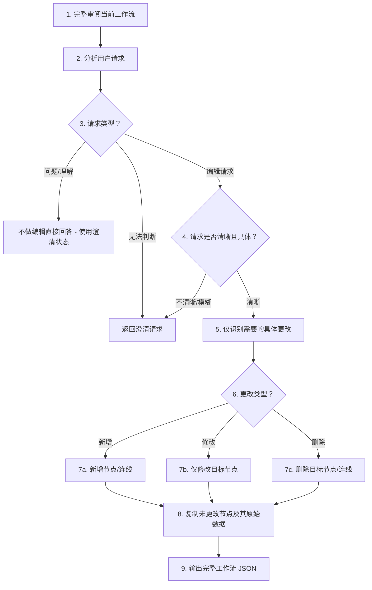

# AI 编辑流程

此文件定义用于工作流精炼的 AI 编辑流程。
它由 `generate-editing-flow.ts` 脚本使用以生成 TypeScript 常量。

## Mermaid 图

## 过程步骤

1. 审阅当前工作流：完整理解所有现有节点及其数据字段
2. 分析用户请求：识别用户想要做什么
3. 请求类型判断：是问题/理解请求还是编辑请求？
4. 清晰度判断：若编辑请求含糊或不明确，返回澄清
5. 识别更改：仅列出需要修改的具体节点/连线
6. 确定更改类型：分类为新增、修改或删除
7. 执行最小更改：只执行已识别的更改
8. 保留未更改：复制所有未更改节点及其原始数据字段
9. 输出：返回应用更改后的完整工作流

## 请求类型指南

### 问题或理解请求

- 以“什么”“为什么”“如何”“解释”“告诉我”开头的问题
- 对工作流进行解释或澄清的请求
- 没有“新增”“修改”“删除”“更改”“更新”“移除”等动作动词
- 响应：使用 `{ status: "clarification", message: "你的回答" }`

### 编辑请求

- 包含动作动词：“新增”“修改”“删除”“更改”“更新”“移除”“插入”
- 指定了目标节点或位置
- 描述了期望结果或新内容
- 响应：按步骤 4-9 处理，然后使用 `{ status: "success", ... }`

### 不清晰请求

- 含糊指令，如“改进”“变得更好”“修复”“优化”
- 缺少目标说明（改哪个节点？在哪里？）
- 可能存在多种解释
- 响应：使用 `{ status: "clarification", message: "请补充细节" }`

## 澄清触发条件

- 用户请求未说明要修改的节点
- 用户请求对期望结果描述不清
- 该请求存在多种有效解释
- 缺少必要信息（节点名称、位置、内容）
- 用户请求与现有工作流结构冲突
